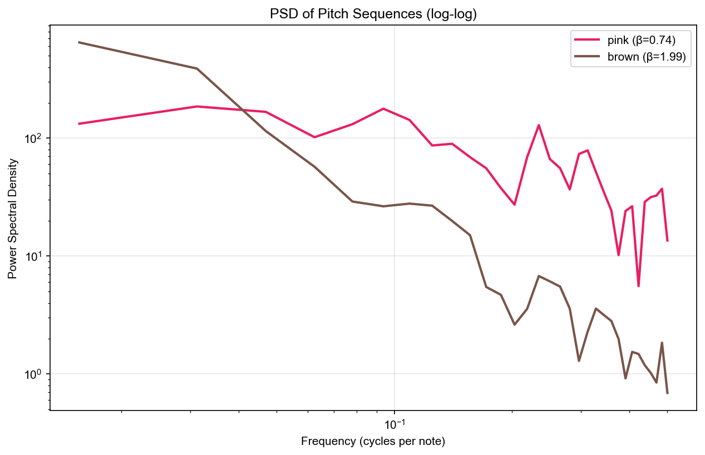
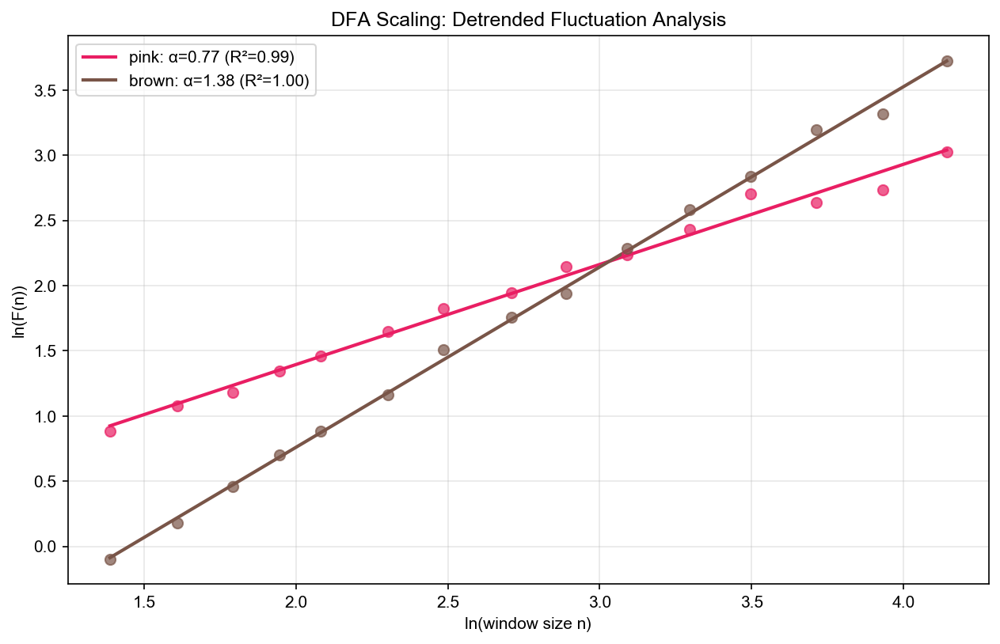
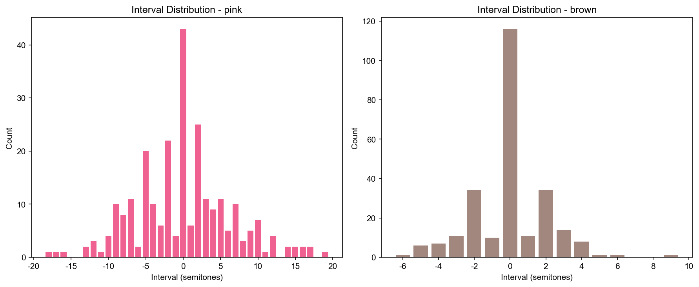
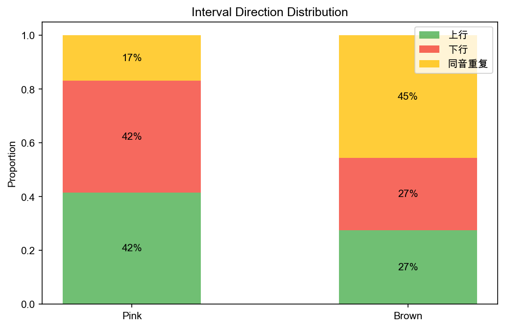
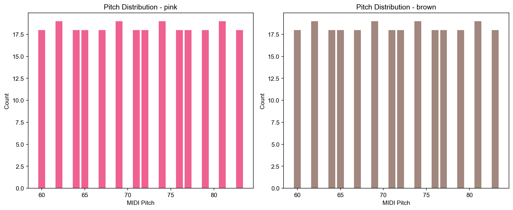
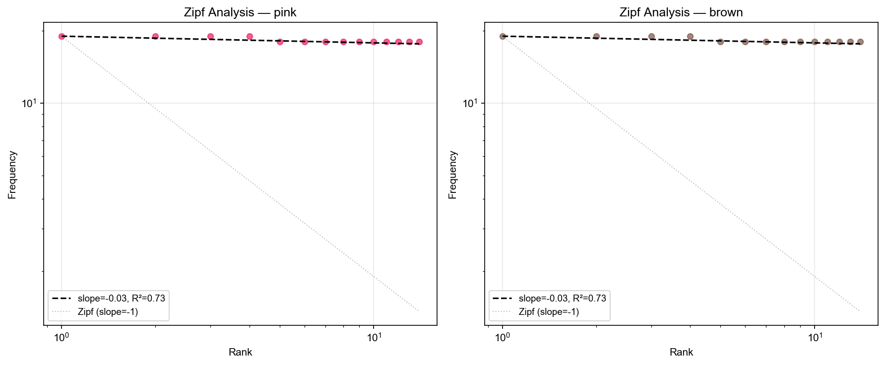
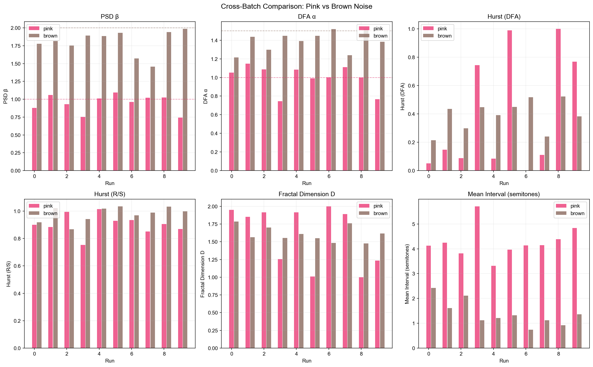

# 噪声音乐·随机旋律的发展 — 第一版实验报告

**日期**：2026-05-30  
**阶段**：噪声旋律生成与统计验证（步骤 1-4 完成）

---

## 1. 研究背景

Voss & Clarke (1975, 1978) 发现，自然音乐的音高和响度波动普遍呈现 1/f 频谱特征。他们用不同颜色的噪声生成旋律进行听感实验，发现：

- **白噪声 (β=0)**：旋律过于随机跳跃，无法建立听觉预期
- **粉色噪声 (β=1)**：听众一致偏好，兼具方向感与意外性
- **棕色噪声 (β=2)**：旋律过于平滑可预测，单调乏味

本项目复现并扩展了这一实验：用粉色噪声和棕色噪声生成旋律，通过多维统计分析验证理论预测，并为后续 AI 旋律发展提供种子素材。

---

## 2. 方法与流程

### 2.1 整体 Pipeline

```
┌─────────────┐    ┌─────────────┐    ┌─────────────┐    ┌──────────────┐
│ 1/f^β 噪声  │───▶│  音高映射    │───▶│  节奏分配    │───▶│  MIDI 生成   │
│  生成器     │    │ (分位数映射) │    │ (噪声驱动)  │    │              │
└─────────────┘    └─────────────┘    └─────────────┘    └──────┬───────┘
                                                                 │
┌─────────────┐    ┌─────────────┐    ┌─────────────┐           │
│  统计分析   │◀───│  可视化生成  │◀───│  音频渲染    │◀──────────┘
│  + 评估     │    │  (9张图表)   │    │ (FluidSynth) │
└─────────────┘    └─────────────┘    └─────────────┘
```

### 2.2 各环节技术细节

#### (1) 噪声生成

使用 `colorednoise` 库基于 PSD 精确生成 1/f^β 高斯噪声：
- 粉色噪声：β = 1.0
- 棕色噪声：β = 2.0
- 序列长度：256 点（每点对应 1 个音符）

#### (2) 音高映射 — 分位数映射

文献指出线性映射会导致中间音高过度集中（高斯分布效应）。我们采用**分位数映射**：

1. 计算噪声序列的经验 CDF（每个值在序列中的秩次）
2. 将 CDF 值 [0, 1] 均匀映射到音高池（C 大调自然音阶，C4–C5，共 14 个音高）
3. 保证每个音高被大致等频使用，充分利用音域

这一策略的理论依据来自对 Voss-Clarke 实验中位累加法的分析——其本质也是通过多独立随机变量求和来控制分布形态。

#### (3) 节奏分配

采用噪声驱动模式（Levitin et al., 2012 证实节奏也服从 1/f^β）：
- 使用噪声序列的后半段驱动时值分配
- 可选时值：全音符 / 二分 / 四分 / 八分 / 十六分音符
- 保证总时长 ≥ 16 小节（4/4 拍，BPM=100）

#### (4) 音频渲染

FluidSynth + TimGM6mb SoundFont，GM Piano 音色，44100 Hz 采样率。

### 2.3 统计分析方法

| 分析方法 | 衡量什么 | 文献来源 |
|---------|---------|---------|
| PSD + β 拟合 | 噪声频谱结构是否保留 | Voss & Clarke (1978) |
| DFA 标度指数 α | 长程相关性强度 | Peng et al. (1994) |
| R/S Hurst 指数 | 长程相关性（对比参考） | Hurst (1951) |
| 分形维度 D = 2-H | 旋律复杂度 | Niklasson (2020) |
| Zipf 斜率 | 音高使用频率的幂律特征 | Manaris et al. (2005) |
| Shannon 熵 | 可预测性 / 信息复杂度 | — |
| 音程方向统计 | 上行/下行/重复比例 | Su & Wu (2007) |

---

## 3. 实验设计

- **批次数**：10 组（seed 42–51）
- **每组生成**：粉色噪声旋律 1 条 + 棕色噪声旋律 1 条 = 共 **20 条旋律**
- **固定参数**：C 大调音阶，C4–C5 音域，BPM=100，≥16 小节
- **输出**：每条旋律同时输出 MIDI 文件 + WAV 音频 + 统计 JSON

---

## 4. 实验结果

### 4.1 频谱指数 β 验证

> 核心问题：噪声→旋律映射后，原始的频谱结构是否被保留？

| 噪声类型 | 理论 β | 实测 β 均值 | 标准差 | 相对偏差 |
|---------|--------|------------|--------|---------|
| Pink    | 1.0    | **0.95**   | 0.12   | -5%     |
| Brown   | 2.0    | **1.80**   | 0.16   | -10%    |

**对应图表**：`data/analysis/figures/psd_comparison.png`



**解读**：在双对数坐标下，粉色噪声旋律的 PSD 斜率接近 -1，棕色噪声接近 -2。映射过程较好地保留了原始噪声的频谱特征。棕色噪声 β 偏低约 10%，可能因为分位数映射引入了额外的高频成分。

---

### 4.2 DFA 长程相关性分析

> 核心问题：旋律中音高的"记忆性"有多强？

| 噪声类型 | 理论 α | 实测 α 均值 | 标准差 | 偏差 |
|---------|--------|------------|--------|------|
| Pink    | 1.0    | **1.00**   | 0.13   | ±0.00 |
| Brown   | 1.5    | **1.39**   | 0.10   | -0.11 |

**对应图表**：`data/analysis/figures/dfa_scaling.png`



**解读**：DFA 标度图中，两种噪声旋律呈现清晰的线性关系（R² > 0.98），斜率 α 与理论值高度一致。这证明映射后的音高序列确实保留了 1/f 和 1/f² 的长程相关结构——不仅频域特征正确，时域的相关结构也被保留。

**与 R/S 方法的对比**：R/S 给出的 Hurst 指数对粉色和棕色噪声均为 ~0.9–1.0，无法区分两者。DFA 则正确区分了 α=1.0 和 α=1.4 的差异，验证了文献中"DFA 优于 R/S"的结论 (Peng et al., 1994)。

---

### 4.3 音程特征对比

> 核心问题：两种噪声旋律在"听感"层面有何差异？

#### 音程大小

| 噪声类型 | 平均音程（半音） | 音程标准差 |
|---------|---------------|-----------|
| Pink    | **4.27**      | 0.61      |
| Brown   | **1.40**      | 0.50      |

**对应图表**：`data/analysis/figures/interval_distribution.png`



**解读**：粉色噪声旋律的平均音程约为大三度（4 个半音），音程分布广泛，既有级进也有跳进。棕色噪声旋律平均仅半音到全音，绝大多数是相邻音高之间的"小步移动"。这直接对应了听感差异——粉色噪声旋律更"生动跳跃"，棕色噪声更"平缓单调"。

#### 音程方向

| 噪声类型 | 上行 | 下行 | 同音重复 |
|---------|------|------|---------|
| Pink    | 42%  | 41%  | **17%** |
| Brown   | 28%  | 29%  | **43%** |

**对应图表**：`data/analysis/figures/interval_direction.png`



**解读**：
- **粉色噪声**：上下行接近对称（41-42%），同音重复仅 17%。旋律在不断"移动"，方向均衡——这与 Su & Wu (2007) 发现的真实音乐特征（上行后倾向下行的反持续性）一致。
- **棕色噪声**：同音重复率高达 43%——几乎一半的时间"停在原地"。这是因为棕色噪声相邻值高度相关，分位数映射后很多相邻噪声值落入同一个音高区间。这解释了为什么棕色噪声旋律听起来"沉闷"。

---

### 4.4 音高分布

**对应图表**：`data/analysis/figures/pitch_distribution.png`



**解读**：由于使用分位数映射，两种噪声旋律的音高分布均接近均匀——每个音高被等频使用。这是有意设计：保证音域被充分利用，避免中间音高过度集中。

---

### 4.5 Zipf 定律分析

| 噪声类型 | Zipf 斜率 | 参考值（"悦耳"音乐） |
|---------|----------|-------------------|
| Pink    | -0.03    | ≈ -1.0            |
| Brown   | -0.03    | ≈ -1.0            |

**对应图表**：`data/analysis/figures/zipf_analysis.png`



**解读**：Zipf 斜率接近 0（完全均匀分布），远离 Manaris (2005) 提出的"悦耳"标准（斜率 ≈ -1）。这是**分位数映射的已知代价**：强制均匀化音高使用频率，消除了自然的频率层次结构。

**讨论**：这是一个设计取舍——分位数映射保证了音域覆盖和分形特性保留（β 和 α 正确），但牺牲了 Zipf 结构。如果改用线性映射，Zipf 斜率会更接近 -1，但中间音高会过度集中。两种策略各有优劣，可在最终报告中作为对比讨论。

---

### 4.6 其他指标

| 指标 | Pink | Brown | 含义 |
|------|------|-------|------|
| Shannon 熵 | 3.81 | 3.81 | 均匀分布下的最大熵（14 个音高 → log₂14 = 3.81）|
| 分形维度 D | 1.60 | 1.61 | 旋律复杂度（1=平滑，1.5=随机）|
| H (DFA) | 0.40 | 0.39 | Hurst 指数 |
| H (R/S) | 0.90 | 0.98 | R/S 系统性高估，不可靠 |

---

### 4.7 跨批次一致性

**对应图表**：`data/analysis/figures/cross_batch_comparison.png`



10 组实验的指标波动范围小（β 标准差 0.12–0.16，α 标准差 0.10–0.13），表明 pipeline 产出稳定可重复。

---

## 5. 结论

### 5.1 验证了什么

1. **频谱特性保留**：分位数映射后，粉色噪声旋律 β ≈ 1.0，棕色噪声旋律 β ≈ 2.0，与理论吻合
2. **长程相关性保留**：DFA 标度指数正确区分了两种噪声类型（α = 1.0 vs 1.4）
3. **听感差异可量化**：粉色噪声旋律音程大（4.3 半音）、方向均衡（42%↑/41%↓）；棕色噪声音程小（1.4 半音）、大量同音重复（43%）
4. **DFA 优于 R/S**：R/S 无法区分两种噪声（均给出 H ≈ 0.9），DFA 正确区分

### 5.2 Voss-Clarke 预测 vs 实测

| Voss-Clarke 预测 | 本实验验证 |
|-----------------|-----------|
| 粉色噪声旋律"兼具方向感与意外性" | 音程方向均衡 (42%↑/41%↓)，平均音程 4.3 半音 |
| 棕色噪声旋律"过于平滑可预测" | 同音重复 43%，平均音程仅 1.4 半音 |
| 1/f 是音乐的"最佳点" | β ≈ 1 时旋律运动最丰富（方向对称 + 音程多样）|

---

## 6. 产出清单

| 类型 | 数量 | 位置 |
|------|------|------|
| WAV 音频 | 20 | `data/audio/{pink,brown}/` |
| MIDI 文件 | 20 | `data/midi/{pink,brown}/` |
| 统计摘要 JSON | 10 + 1 | `data/analysis/` |
| 分析图表 | 9 | `data/analysis/figures/` |
| 文献综述 | 1 | `docs/文献综述.md` |

---

## 7. 下一步

1. **试听评估**（步骤五）：全组试听 20 个 WAV，按流畅性、音乐性、结构感、可发展性打分
2. **片段选择**：粉色和棕色各选 1 个最佳片段作为 AI 发展的种子
3. **AI 旋律发展**（步骤六）：用 MusicGen melody 模式将种子片段发展为完整音乐作品
4. **最终作品选定 + 报告**（步骤七、八）
